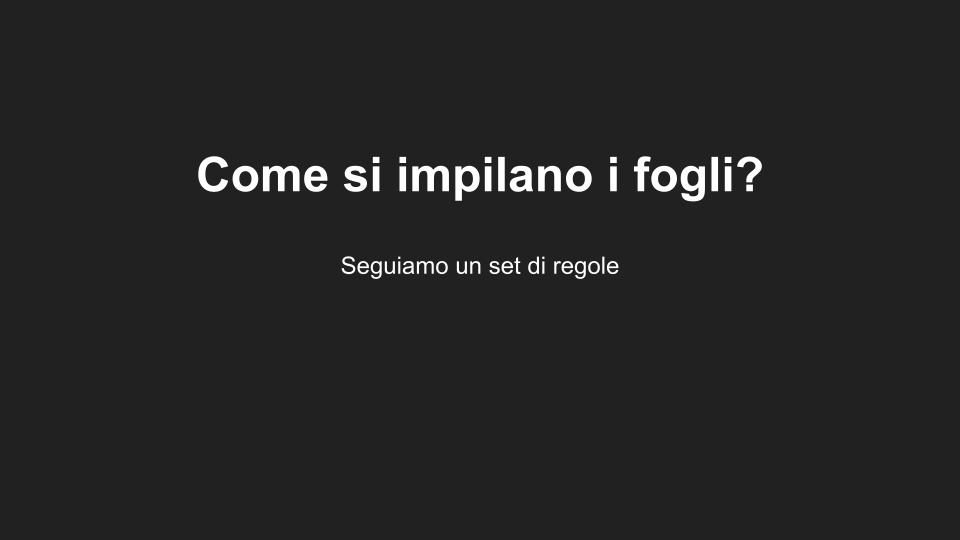

Esame di Didattica dell'Informatica, A.A. 2024/2025

# Inquadramento del lavoro

## Livello di scuola, classe/i, indirizzo
Istituti Tecnici e Professionali

Indirizzo : Informatica e Telecomunicazioni

Disciplina : Informatica

Livello : Secondo biennio e quinto anno

L'attività è principalmente orientata agli ultimi anni di un indirizzo informatico, ma può essere svolta anche in altri indirizzi se ci sono sufficienti ore di Informatica e vengono soddisfatti i prerequisiti descritti di seguito nel documento.

## Motivazione e Finalità
- L'attività presenta le principali differenze tra scope statico e dinamico nei linguaggi di programmazione, tramite lezioni frontali, attività unplugged e attività di laboratorio.

- Questa attività approfondisce concetti relativi ai linguaggi di programmazione e il loro uso. 
La maggior parte dei linguaggi di programmazione utilizza scope statico e spesso è l'unico presentato agli studenti. Con questa attività si mira a rafforzare il modello mentale[4] associato all'esecuzione del codice e correggere eventuali misconcezioni[4] analizzando il comportamento dei due scope a confronto.

## Innovatività
Questo è un argomento considerato avanzato e che spesso è trattato solo in ambito universitario.
Per questa attività è stata creata un'applicazione web interattiva per l'esecuzione e la visualizzazione di codice con scope statico e dinamico (Prendendo ispirazione da [Python Tutor](pythontutor.com)).
Inoltre sono state progettate delle attività unplugged per dare un'idea concreta di come si comporta il codice con i due scope.

## Prerequisiti
- Programmazione base in javascript (variabili, funzioni, condizionali, cicli)

### Percorso
Questa attività può rientrare in un percorso in cui si analizzano i vari aspetti dei linguaggi di programmazione (paradigmi, casi d'uso, sintassi), ma può anche essere trattata da sola per rafforzare la comprensione di un linguaggio di programmazione (in questo caso javascript).

## Contenuti (spiegati a un informatico)
- Scope statico e dinamico
- Passaggio di parametri
- Stack frame

## Traguardi e Obiettivi

### Traguardi/obiettivi generali dai documenti ministeriali/proposte
- Utilizzare le strategie del pensiero razionale negli aspetti dialettici ed algoritmici per affrontare situazioni
problematiche elaborando opportune soluzioni [2]
- Scegliere dispositivi e strumenti in base alle loro caratteristiche funzionali [2]

### Traguardi/obiettivi generali
- Visualizzare i frame delle funzioni come dei fogli di carta che si sovrappongono seguendo protocolli diversi in base allo scope.
- Identificare e applicare strategie di risoluzione dei problemi considerando i diversi modelli di gestione della memoria e degli ambienti di esecuzione
- Utilizzare modelli astratti e rappresentazioni mentali per visualizzare e comprendere l'evoluzione degli stati durante l'esecuzione dei programmi

### Obiettivi specifici in forma operativa
- (Comprendere)[3] Lo studente/la studentessa è in grado di descrivere il comportamento di un programma con scope statico e dinamico
- (Comprendere)[3] Lo studente/la studentessa è in grado di descrivere le principali differenze tra scope statico e dinamico
- (Applicare)[3] Lo studente/la studentessa è in grado di implementare programmi con scope statico e dinamico
- (Valutare)[3] Lo studente/la studentessa è in grado di giustificare la scelta di un linguaggio di programmazione con un determinato scope rispetto all'altro

## Metodologie didattiche
- Lezione frontale : il docente presenta gli argomenti con l'ausilio delle slide, durante la lezione si pongono domande agli studenti per riprendere l'attenzione e risolvere eventuali dubbi
- Collaborative learning : durante le attività unplugged e di laboratorio previste si invoglia gli studenti a collaborare per risolvere esercizi
- Unplugged : si insegnano concetti informatici senza l'uso di un computer[5], in questo caso con dei fogli di carta

- Si mira a rafforzare la macchina concettuale[4] relativa all'esecuzione di codice e correggere misconcezioni comuni derivanti dal solo uso dello scope statico

## Tempi
- Scope statico : lezione frontale con attività unplugged (circa 1 ora)
- Scope dinamico : lezione frontale con attività unplugged (circa 1 ora)
- Attività di laboratorio (almeno 2 ore)

## Spazi
Classe, laboratorio di informatica

## Materiali e Strumenti
- Aula con proiettore
- Computer con un qualsiasi browser installato (per le attività di laboratorio)
- Fogli di carta per l'attività unplugged
- L'applicazione web sviluppata

# Sviluppo dei contenuti
## Guida per gli insegnanti
### Prima lezione
Per questa prima lezione utilizzeremo le slide

Iniziamo fissando il vocabolario che utilizzeremo, diamo una prima definizione di scope e ambiente[1].

\

Per favorire l'introduzione del concetto di ambiente iniziamo col fare una prima distinzione tra ambiente globale e ambiente locale.

\

In questo esempio si vuole far notare la differenza tra lo scope delle due variabili. "global_x" è definita nell'ambiente globale ed è visibile in tutto il programma, mentre "local_x" è definita all'interno della funzione f, quindi è visibile solo ad essa (nel suo ambiente locale).

\

Nella slide precedente le due variabili avevano nomi diversi. In questa slide ci sono due variabili "x", una dichiarata nell'ambiente globale, l'altra nell'ambiente locale di "f".
Con questo esempio si vuole far notare che pur avendo lo stesso nome esse sono variabili diverse a seconda del contesto.
Si chiede agli studenti cosa stampa il codice per portarli al ragionamento e avere un riscontro sulla spiegazione. Dopodichè mostrare la soluzione (nella slide successiva) e discuterla. Se non dovesse essere chiaro soffermarsi sul punto, si può ad esempio ragionare su programmi trattati in lezioni precedenti.

\

Questo esempio estende il precedente, viene dichiarata una funzione "g", ma la variabile "x" non viene dichiarata nel suo ambiente globale. Per questo esempio possiamo chiedere prima agli studenti cosa stampa il codice, poichè è un concetto con cui dovrebbero essere familiari, quindi ci si può affidare alla loro intuizione. In questo modo si riesce a verificare se si sono create delle misconcezioni[4] (ad esempio che la variabile x sia quella in f poichè dichiarata per ultima).
Dopo che gli studenti hanno risposto si spiega che, poichè la "x" non è stata dichiarata nell'ambiente locale di "g" si fa riferimento all'ambiente globale.

\

In questa slide si vuole dare l'idea di pensare agli ambienti come fogli di carta appartenenti a ogni funzione, "Global_frame" è l'ambiente globale in cui è stata dichiarata "x" con valore 10, "f" è l'ambiente locale della funzione f in cui è stata dichiarata "x" con valore 20. I due fogli vengono sovrapposti in modo da "unirli", quando si cerca il riferimento di una variabile si parte dal foglio più in alto (in questo caso f), se la variabile non è presente si passa al foglio inferiore (in questo caso Global_frame). Questo da una prima idea di visibilità di una variabile, sarà più chiaro con gli esempi successivi e con l'attività unplugged.

\

Qui si mostrano gli ambienti a confronto con il codice nel caso in cui venga chiamata la funzione f.

\

Qui si mostrano gli ambienti quando viene chiamata la funzione g, in questo caso è chiaro che l'ambiente locale di "g" non è sufficente e che bisogna sovrapporlo all'ambiente globale per avere il quadro completo.

\

In questo esempio ci sono più livelli di annidamento. Fino ad ora abbiamo distinto solo tra ambiente globale e locale. Qui si fa notare che l'ambiente di "g"  è dichiarato all'interno dell'ambiente di "f", quindi va sovrapposto al di sopra di esso.

\

Fino ad ora abbiamo visto esempi semplici, con solo 2 funzioni. Abbiamo dato l'intuizione di ambiente tramite i fogli di carta, nelle prossime slide cercheremo di dare l'intuizione di scope statico e dinamico come dei "set di regole" su come impilare i fogli generalizzando per più funzioni.

\

Iniziamo dallo scope statico, diamo il seguente set di regole. Sulla destra vediamo un esempio di catena statica (definita nella slide successiva).

\

Quì si da una breve definizione di catena statica, la si può pensare come una "gerarchia" delle funzioni.

\

Nelle prossime slide si mostra un esempio di esecuzione del programma con scope statico. Per prima cosa definiamo la gerarchia e i fogli con i vari ambienti.

\

Iniziamo l'esecuzione, dichiariamo la variabile x nell'ambiente globale.

\

Viene chiamata la funzione f

\

Quando la funzione f viene chiamata viene creato il suo ambiente locale, e poichè nella catena statica f compare come figlia dell'ambiente globale, sovrapponiamo l'ambiente di f all'ambiente globale.

\

Viene dichiarata la variabile x=20 quindi la aggiungiamo all'ambiente di f

\

In questa linea si utilizza la variabile x, per trovarne il riferimento partiamo dal foglio più alto.

\

Quando si ritorna da una funzione il suo ambiente viene distrutto.

\

\

Chiamiamo la funzione g

\

Creiamo l'ambiente di g e lo sovrapponiamo all'ambiente globale (come descritto dalla catena statica)

\

In questa linea compare la variabile x. Per trovarne il riferimento partiamo dal foglio più in alto, in questo caso essa non compare nell'ambiente di g, quindi si passa al foglio inferiore (l'ambiente globale)

\

Quando si ritorna si distrugge l'ambiente di g. Dopodichè il programma termina. 
Chiedere agli studenti se hanno capito e se hanno domande e nel caso ripetere i passaggi poco chiari.

\

A questo punto si effettua la prima attività unplugged.
Si prenda in considerazione il codice descritto nella slide.
1. Si dividono gli studenti in gruppi: poichè sono presenti 4 funzioni + lo scope globale si potrebbero creare gruppi da 5 in modo che ogni studente abbia un ambiente da gestire, oppure si possono dividere in gruppi da 2, uno studente esegue il codice e un altro gestisce gli ambienti. Valutare in base al numero di studenti e gli spazi a disposizione, se possibile si cerchi di mescolare gli studenti che sono stati più al passo durante la lezione con studenti che hanno avuto più dubbi in modo da favorire il dialogo
2. Dopo aver formato i gruppi essi devono definire la catena statica del programma
3. Verificare che gli studenti abbiano definito in modo corretto la catena statica e eventualmente riportare alla lavagna la versione corretta
4. I gruppi devono creare un foglietto per ogni funzione e uno per l'ambiente globale.
5. I gruppi eseguono il codice.
 * Nel caso si sia scelto di dividere gli studenti in gruppi da 5 ognuno gestirà il proprio ambiente e la sua parte di codice.
 Quando si incontra una chiamata di funzione lo studente passa il controllo al chiamato, che sovrappporrà il proprio foglio seguendo la catena statica. Al ritorno lo studente rimuoverà il proprio foglio e ripasserà il controllo al chiamante.
 * Nel caso siano stati formati gruppi da due, uno studente darà le istruzioni e l'altro gestirà gli ambienti e fornirà i valori delle variabili.
 Ad esempio se il primo compagno deve stampare la variabile "saldo" sarà compito del secondo compagno reperire il giusto valore dagli ambienti.
6. Si passa tra i vari gruppi per controllare che l'esercizio venga svolto in maniera corretta e si chiariscono eventuali dubbi.
7. Dopo che tutti i gruppi avrranno finito l'esercizio si passa ad una fase di discussione. Si può utilizzare l'applicazione web per mostrare l'esercizio in maniera interattiva ([Esercizio unplugged statico](https://sij82.github.io/didattica/lezione_1/esempio04/), per vedere gli output bisogna aprire la console da sviluppatore)

\

L'attività si può riproporre facilmente con altri programmi, inoltre è possibile pianificare una lezione di laboratorio in cui gli studenti utilizzano l'applicazione web per sperimentare con lo scope statico e gli ambienti.
Si possono assegnare esercizi come creare programmi o descrivere il comportamento di programmi forniti dal docente.
Se gli studenti riescono a creare e descrivere comportamenti di programmi con scope statico questo è un buon indicatore che abbiano acquisito i concetti di questa lezione.

\

### Seconda lezione
Nella prima lezione abbiamo introdotto i concetti di ambiente e scope statico, ora ci soffermiamo sullo scope dinamico

\

Definiamo il nuovo set di regole. Facciamo notare che non abbiamo bisogno della catena statica, i nuovi ambienti vengono sovrapposti sempre in cima alla pila.

\

Vediamo l'esecuzione di un programma con scope dinamico. Iniziamo dall'ambiente globale. Dichiariamo x=10

\

Viene chiamata la funzione g

\

Creiamo l'ambiente di g e lo poniamo in cima alla pila

\

Viene stampata la variabile x, ricaviamo il valore scorrendo la pila dalla cima al fondo.

\

Viene rimosso l'ambiente di g e viene chiamata f

\

Viene creato l'ambiente di f e viene posto in cima alla pila

\

Viene dichiarata x=20

\

Viene chiamata g.

\

Viene creato l'ambiente di g e posto in cima alla pila.

\

Viene stampata x, per ricavarne il valore scorriamo sempre la pila da cima a fondo, in questo caso viene trovata in f. Facciamo notare che il codice di g è sempre lo stesso, ma a secondo del contesto e dal chiamante stampa valori diversi.

\

A termine dell'esempio si può discuterne per risolvere eventuali dubbi, si può anche mostrare l'esempio interattivo tramite l'applicazione web ([Esempio scope dinamico](https://sij82.github.io/didattica/lezione_1/esempio05/)) e proporre altri esempi.

Ora si può svolgere la seconda attività unplugged. L'esecuzione è uguale alla precedente, con le seguenti differenze:
* Ci sono 3 funzioni + scope globale, quindi sono consigliati gruppi da 4
* Gli studenti seguono le regole dello scope dinamico

L'esercizio è disponibile anche sull'applicazione web ([Esercizio unplugged dinamico](https://sij82.github.io/didattica/lezione_1/esempio06/)), assicurarsi di attivare lo scope dinamico "👋".

Si possono proporre altri esercizi e provare a far eseguire i programmi anche con scope statico per far notare le differenze nel comportamento.

\

Al termine dell'attività unplugged e della discussione della soluzione segue una fase di discussione delle principali differenze tra scope statico e dinamico e le varie motivazioni dietro la scelta di uno rispetto all'altro.

\
\
\

Possono seguire attività di laboratorio ricollegandosi ad altri argomenti svolti durante l'anno, ad esempio facendo risvolgere esercizi precedenti provando ad utilizzare lo scope dinamico.

### Possibili approfondimenti da proporre
- Come vengono implementati gli ambienti 
- Gestione dello stack
- Static binding e dynamic binding

### Valutazione
Poichè durante le lezioni si hanno attività interattive e unplugged si riesce ad avere un feedback costante da parte degli studenti, questo facilita la verifica del raggiungimento degli obiettivi di apprendimento.
Inoltre con l'applicazione web si possono creare nuovi esercizi in modo flessibile ed è facile verificare se gli esercizi svolti dagli studenti siano corretti.
E' anche possibile creare dei laboratori con dei test case predefiniti che danno un feedback immediato sullo svolgimento dell'esercizio.

## Materiale didattico per studenti
* Slide su scope statico e dinamico (Scope statico e scope dinamico.pdf)
* [Applicazione web per poter eseguire codice con sintassi javascript con scope statico e dinamico](https://sij82.github.io/didattica/)

# Bibliografia
[1] Gabbrielli, M., & Martini, S. (2005). Linguaggi di programmazione: principi e paradigmi. McGraw-Hill Italia.

[2] [Linee guida secondo biennio e quinto anno per istituti tecnici e professionali](http://www.gazzettaufficiale.it/eli/gu/2012/03/30/76/so/60/sg/pdf)

[3] [Definire operativamente la competenza: processi e strutture](https://www.rizzolieducation.it/content/uploads/2018/07/0040.Competenze_2ciclo.pdf)

[4] [Lodi, M. (2025). Didattica della programmazione](https://www.cs.unibo.it/~michael.lodi2/csed2025/didaprogtutte.pdf)

[5] [Lodi, M. Davoli, R.(2025). Informatica senza computer](https://www.cs.unibo.it/~michael.lodi2/csed2025/unplugged.pdf)

# Licenza del documento
[Creative Commons](https://creativecommons.org/licenses/by-sa/4.0/deed.it)

Tutto il materiale è stato creato da zero per questa attività.
Il codice sorgente per l'applicazione web e questa guida è disponibile su github [https://github.com/SIJ82/didattica](https://github.com/SIJ82/didattica)
